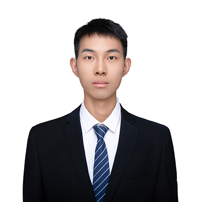

<html>

<table class="tg" style="undefined;table-layout: fixed; width: 556px">
<colgroup>
<col style="width: 99.2px">
<col style="width: 68.2px">
<col style="width: 168.2px">
<col style="width: 70.2px">
<col style="width: 150.2px">
</colgroup>
<thead>
  <tr>
    <td class="tg-0pky" rowspan="3"></td>
    <td class="tg-p6v9">姓名</td>
    <td class="tg-p6v9">陈鑫</td>
    <td class="tg-p6v9">学历</td>
    <td class="tg-p6v9">硕士</td>
  </tr>
  <tr>
    <td class="tg-p6v9">籍贯</td>
    <td class="tg-p6v9">河南</td>
    <td class="tg-p6v9">生日</td>
    <td class="tg-p6v9">1999-04-16</td>
  </tr>
  <tr>
    <td class="tg-p6v9">邮箱</td>
    <td class="tg-p6v9">1354123040@qq.com</td>
    <td class="tg-p6v9">电话</td>
    <td class="tg-p6v9">15937653097</td>
  </tr>
</thead>
<tbody>
  <tr>
    <td class="tg-0lax" colspan="5">
    教育背景：

    2021.09 - 2024.07 郑州大学 电子与通信工程 硕士
    研究方向： 机器学习、 深度学习、 模式识别、 生物信息学
    主修课程： 随机过程与数理统计、 数字图像处理、现代数字信号处理、 宽带无线通信、 数字图像视频处理、现代编码理论（全英） ……
    获奖情况： 国家一等学业奖学金

    2021.09 - 2024.07 河南科技学院 应用电子技术教育 本科
    主修课程： 高等数学、 线性代数、 概率论、 C 语言、 数电、 模电、 通信原理、 高频电子线路、 STM32、 信号与系统、 数字信号处理 ……
    获奖情况： 国家励志奖学金、 校级一等奖学金
  </tr>
  <tr>
    <td class="tg-0lax" colspan="5">
    项目经历：

    1. 2021.09-2022.01 基于 5G&8K 全景立体 VR 视频直播系统及全景视频人脸识别系统 研究员

    通过将八目相机获取到的视频流进行实时拼接等处理后推送至推流服务器，通过 VR 一体机、沉浸式Cave 等设备拉流后进行观看
    接收全景视频流进行人脸检测与识别。针对全景视频人脸识别进行算法改进，结合可变形卷积进行形变人脸特征提取，并制作全景人脸数据集

    2. 2022.02-2022.09 基于 Django 框架下师生出入校权限管理系统 研究员
    使用 MySQL 数据库存储教师与学生信息，根据规则算法决定是否授权教师/学生出入学校
    使用 CSS、 HTML 以及 JavaScript 优化系统界面

    3. 2022.10-2023.01 基于 PyQt5 实现教师信息管理系统 研究员
    使用 Qtdesigner 设计 GUI 界面
    设计程序， 使系统包含：教师信息的增、删、查、改、批量导入及导出、条件筛选等功能
  </tr>
  <tr>
    <td class="tg-0lax" colspan="5">
    科研经历：

    1. CCF C 类会议一篇一作 “MOVNG: Applied a Novel Sparse Fusion Representation into GTCN for Pan-cancer Classification and Biomarker Identification”

    2. 专利一项 “一种基于 SMOTE-ReliefF-XGBoost 算法的质差小区根因定位方法”
    四/六级证书 六级 524’

    3. 第十九届中国研究生数学建模竞赛（光谷·华为杯） 三等奖
  </tr>
  <tr>
    <td class="tg-0lax" colspan="5">
    自我评价：

    1. 本人熟练使用 Python、 MATLAB 语言，会基础使用 C/C++ 、 R 语言
    2. 本人熟悉使用 Pytorch、 scikit-learn、 PyG 、 OpenCV 深度学习和机器学习框架，具备基本人工智能 AI 算法、 大数据算法设计和开发能力
    3. 本人具备翻译英文文献（论文）并理解的能力
    4. 本人具备 Linux 系统开发经验， 且本人乐观向上、 团队协作意识强

  </tr>
</tbody>
</table>
</html>
